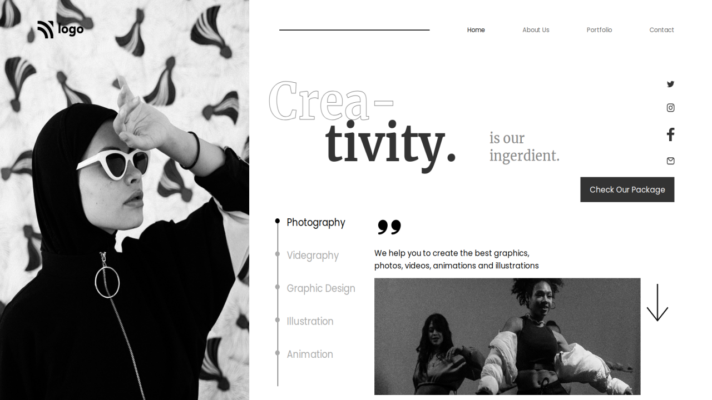

# Project 14

### `Nishok Maharaaj`

## Learnings    

This is the fourteenth project of HTML and CSS class. In this I have used some of the new CSS selectors such as `:nth-child()`. In this project the combination of every CSS property have been utilized effectively to achieve the end result.

## Efforts

This project took around 4 hours to build the webpage, the designs and positioning of each element consumed lot of time.

### Screenshot

